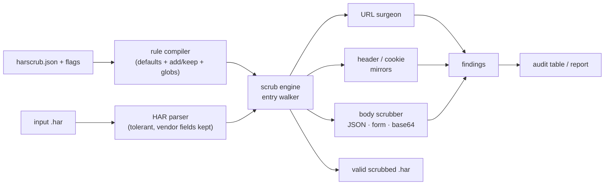

# harscrub

[English](README.md) | [中文](README.zh.md) | [日本語](README.ja.md)

[](LICENSE)   [](CONTRIBUTING.md)

**HAR ファイルを共有する前に認証ヘッダー・Cookie・トークン・ボディを消し込むオープンソース CLI——ルール設定可能かつフォーマット保持で、キャプチャは DevTools でそのまま開けます。**


```bash
# not yet on npm — install from a checkout of this repository
npm install && npm run build && npm pack
npm install -g ./harscrub-0.1.0.tgz
```

## なぜ harscrub？

「HAR ファイルを添付してください」はネットワーク系バグテンプレートの決まり文句——しかし HAR はセッションの完全な記録です：`Authorization` ヘッダー、セッション Cookie、URL 内の OAuth code、JSON ボディ内の refresh token、しかも一部は base64 エンコードされていて目視では見えません。こうしたファイルが毎日、公開の issue トラッカーに貼られています。既存の逃げ道はどれも不十分です：5 MB の JSON を手で編集すればミラーを見落とし（同じ Cookie が生の `Cookie` ヘッダーに*も*パース済みの `cookies` 配列に*も*いる——片方を消しても漏れたまま）、ブラウザ型サニタイザーは消したいはずの機密をアップロードすることを意味し CI でも動かず、`jq` のワンライナーは毎回 HAR のセマンティクスをゼロから再発明し、gitleaks のようなシークレットスキャナーは*検出*はしても*修復*はしません。harscrub は HAR セマンティクスの上に築かれたスクラバーです：一つのルールセットが名前ベースの消し込み（ヘッダー、Cookie、クエリパラメータ、任意の JSON 深さの body キー）と形状ベースのトークン検出（JWT、AWS、GitHub、Slack、Stripe、PEM 秘密鍵など）を駆動し、すべてのミラーを一貫して処理——デコードした base64 ボディも含めて——出力は依然として正しい、ビューアで読み込める HAR で、機密でなかった部分はバイト単位で不変です。

| | harscrub | 手作業編集 | ブラウザ型 HAR サニタイザー | 素の jq | シークレットスキャナー |
|---|---|---|---|---|---|
| ターミナル / CI でオフライン動作 | ✅ | ✅ | ❌ アップロードかページ読込 | ✅ | ✅ |
| HAR のミラーを理解（ヘッダー ↔ 配列、url ↔ queryString、text ↔ params） | ✅ | ❌ 一箇所見落としがち | 🟡 まちまち | ❌ 全部手書き | ❌ |
| base64 ボディをデコードして消し込む | ✅ | ❌ 目に見えない | 🟡 まれ | ❌ | 🟡 検出のみ |
| 出力が正しい読み込み可能な HAR のまま | ✅ | 🟡 タイポ一つで壊れる | ✅ | 🟡 壊しやすい | 対象外 |
| ルール設定可能（名前の追加/除外、カスタム正規表現） | ✅ | 対象外 | ❌ 固定リスト | ✅ ただし自作 | 🟡 検出のみ |
| 報告だけでなく修復する | ✅ + audit モード | ✅ | ✅ | ✅ | ❌ |

<sub>各能力の記述は各方式の公開ドキュメントと実挙動で確認、2026-07。</sub>

## 特徴

- **すべてのミラーを一貫処理** —— HAR はデータを重複保存します（`Cookie` ヘッダーと `cookies[]`、URL と `queryString[]`、`postData.text` と `params[]`）。harscrub は全部を書き換え、機密のコピーは一つも生き残りません。
- **名前ルール + 形状検出** —— デフォルトで資格情報ヘッダー 23 個・クエリパラメータ 27 個・body キー 24 個、加えて 14 のトークンパターン（JWT、Bearer/Basic、AWS、GitHub、GitLab、Slack、Stripe、Google、SendGrid、npm、PEM 秘密鍵）が*リスト外*の場所に潜む機密も捕捉。
- **3 つの消し込みモード** —— `mask`（固定の `[REDACTED]`）、`hash`（決定的な `[REDACTED:9f8e7d6c]` タグ：同じセッショントークンはどこでも同じタグになり、リクエスト間の相関は追える）、`remove`（運び手ごと削除）。
- **フォーマット保持** —— 触れていないエントリはバイト単位で不変、JSON ボディはインデントスタイルを維持、URL は文字列手術で編集（再シリアライズは絶対にしない）、base64 ボディは base64 のまま、ベンダー `_フィールド` はそのまま、サイズは古い値を残さず再計算。
- **ルール設定可能、しかも安全に** —— `harscrub.json` はデフォルトを*拡張*（`add`）するか明示的に穴を開ける（`keep`、グロブ対応）だけ。未知のキーはハードエラーで、`rules` コマンドが有効なルールセットを表示します。
- **CI 向けの audit モード** —— `harscrub audit` は漏れる内容を列挙し（切り詰めたプレビューのみ）終了コード 1 を返すので、pre-commit フックやパイプラインで汚れたキャプチャをブロックできます。機械向けには `--json`。
- **ランタイム依存ゼロ、完全オフライン** —— 必要なのは Node.js だけ。ツールはソケットを一切開かず、devDependency は `typescript` のみです。

## クイックスタート

同梱のサンプルキャプチャ（偽の機密を仕込んだ OAuth ログインフロー）を消し込む：

```bash
# from the root of your checkout
harscrub scrub examples/login.har -o clean.har --report
```

出力（実際の実行記録、stderr）：

```text
harscrub: 25 values redacted across 4 entries (mode: mask)
RULE                  COUNT
cookie                8
body-key              7
query-param           4
header                3
pattern:github-token  1
pattern:slack-token   1
url-credentials       1
```

`clean.har` は DevTools でそのまま開けます。中のクリーンな CDN エントリはバイト単位で不変です。共有の*前*に何が漏れるか見たい——あるいは CI にゲートを設けたい——なら `audit` を（実際の実行記録、先頭行）：

```bash
harscrub audit examples/login.har   # exit 1: findings exist
```

```text
ENTRY  LOCATION                 RULE                  ITEM           PREVIEW
#0     request.postData.params  body-key              client_secret  s3cr3t-cl13n…
#0     request.postData.params  body-key              password       hunter2
#0     request.postData         body-key              password       hunter2
#0     request.postData         body-key              client_secret  s3cr3t-cl13n…
#0     response.headers         cookie                sessionid      b1946ac92492…
#0     response.cookies         cookie                sessionid      b1946ac92492…
#0     response.content         body-key              access_token   eyJhbGciOiJI…
```

`response.content` に注目：この access token は **base64 エンコード**された JSON ボディの中にありました。`--mode hash` ならミラー間の相関が保たれ、同じ JWT はヘッダーでも URL でもパース済み配列でも同じタグになります（実際に取得した値）：

```text
"value": "Bearer [REDACTED:3ac02f51]"
access_token=%5BREDACTED%3A3ac02f51%5D
```

より多くのシナリオは [examples/](examples/README.md) に。

## コマンド

| コマンド | 動作 | 主なオプション |
|---|---|---|
| `scrub [file\|-]` | 消し込んで清浄化済み HAR を出力（デフォルトコマンド） | `-o`、`--in-place`、`--report`、`--drop-content`、`-q` |
| `audit [file\|-]` | 消し込まれる内容を列挙。発見があれば終了コード 1 | `--json` |
| `rules` | 有効なルールセットを表示（デフォルト + ルールファイル） | `--json` |
| `init` | `harscrub.json` の雛形を書き出す | `-o` |

`--mode mask|hash|remove` と `--salt` は scrub と audit に効きます。`--rules <file>` でルールファイルを明示指定、なければ `./harscrub.json` を自動発見（`--no-config` で無視）。終了コードはスクリプト向け：`0` 正常、`1` audit が消し込み対象を発見、`2` 用法または入力エラー。

## ルールファイル

| キー | デフォルト | 効果 |
|---|---|---|
| `mode` / `salt` | `"mask"` / `""` | 消し込みモードと hash のソルト |
| `headers.add` / `.keep` | `[]` | ヘッダー名の追加・除外（グロブ：`x-internal-*`） |
| `cookies.keep` | `[]` | 値を残す Cookie——それ以外は常に消し込み |
| `queryParams.add` / `.keep` | `[]` | 同上、URL クエリパラメータ名に対して |
| `bodyKeys.add` / `.keep` | `[]` | 同上、任意深さの JSON キーとフォームフィールドに対して |
| `patterns.disable` / `.custom` | `[]` | 組み込み検出器を無効化、`{name, regex}` を追加 |
| `dropContent` | `false` | 全レスポンスボディを削除し comment のパンくずを残す |

マージは意図的に加算式です：ルールファイルが `authorization` の保護を静かに外すことはあり得ません。完全なセマンティクス——優先順位、モード、どこで何を書き換えるか、サイズの扱い——は [docs/rules.md](docs/rules.md) に規定しています。

## アーキテクチャ



## ロードマップ

- [x] 全 HAR ミラーを覆うルール駆動の消し込みエンジン、3 モード、トークンパターン、audit/rules/init コマンド、92 テスト + smoke スクリプト（v0.1.0）
- [ ] `--redact-ips` とホスト名の仮名化、インフラ情報に敏感なキャプチャ向け
- [ ] multipart/form-data ボディの解析（現状は各パートをパターンスキャン）
- [ ] Set-Cookie を理解するセッション追跡レポート（「このセッションを共有するエントリは？」）
- [ ] メモリを超えるキャプチャ向けのストリーミングモード
- [ ] npm への公開

完全なリストは [open issues](https://github.com/JaydenCJ/harscrub/issues) を参照。

## コントリビュート

コントリビュート歓迎です。`npm install && npm run build` でビルドし、`npm test` と `bash scripts/smoke.sh`（`SMOKE OK` の表示が必須）を実行してください——このリポジトリは CI を持たず、上記のすべての主張はローカル実行で検証されています。[CONTRIBUTING.md](CONTRIBUTING.md) を読み、[good first issue](https://github.com/JaydenCJ/harscrub/issues?q=is%3Aissue+is%3Aopen+label%3A%22good+first+issue%22) を掴むか、[discussion](https://github.com/JaydenCJ/harscrub/discussions) を始めてください。

## ライセンス

[MIT](LICENSE)
