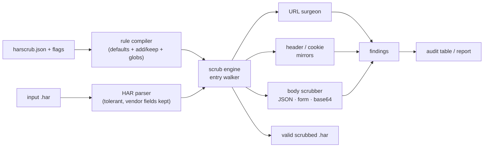

# harscrub

[English](README.md) | [中文](README.zh.md) | [日本語](README.ja.md)

[](LICENSE)   [](CONTRIBUTING.md)

**An open-source CLI that redacts auth headers, cookies, tokens and bodies from HAR files before sharing — rule-configurable and format-preserving, so the capture still loads in DevTools.**


```bash
# not yet on npm — install from a checkout of this repository
npm install && npm run build && npm pack
npm install -g ./harscrub-0.1.0.tgz
```

## Why harscrub?

"Attach a HAR file" is the first line of every network bug template — and a HAR is a full transcript of your session: `Authorization` headers, session cookies, OAuth codes in URLs, refresh tokens in JSON bodies, some of them base64-encoded and invisible to a skim. People paste these into public issue trackers every day. The existing escape hatches all fall short: hand-editing a 5 MB JSON file misses the mirrors (the same cookie lives in the raw `Cookie` header *and* the parsed `cookies` array — clean one and you have still leaked), browser-based sanitizers mean uploading the very secrets you are trying to remove and cannot run in CI, `jq` one-liners re-derive HAR semantics from scratch every time, and secret scanners like gitleaks *detect* but do not *repair*. harscrub is a scrubber built on HAR semantics: one rule set drives name-based redaction (headers, cookies, query params, body keys at any JSON depth) plus shape-based token detectors (JWT, AWS, GitHub, Slack, Stripe, PEM keys, …) across every mirror consistently — including decoded base64 bodies — and the output is still a valid, viewer-loadable HAR in which everything that was not a secret is byte-identical.

| | harscrub | hand-editing | browser HAR sanitizers | raw jq | secret scanners |
|---|---|---|---|---|---|
| Runs offline in the terminal / CI | ✅ | ✅ | ❌ upload or page-load | ✅ | ✅ |
| Knows HAR mirrors (header ↔ array, url ↔ queryString, text ↔ params) | ✅ | ❌ easy to miss one | 🟡 varies | ❌ hand-rolled | ❌ |
| Decodes and scrubs base64 bodies | ✅ | ❌ invisible | 🟡 rarely | ❌ | 🟡 detect only |
| Output stays a valid, loadable HAR | ✅ | 🟡 one typo away | ✅ | 🟡 easy to break | n/a |
| Rule-configurable (add/keep names, custom regexes) | ✅ | n/a | ❌ fixed list | ✅ but you write it | 🟡 detect only |
| Repairs, not just reports | ✅ + audit mode | ✅ | ✅ | ✅ | ❌ |

<sub>Capability claims checked against each approach's public docs and behavior, 2026-07.</sub>

## Features

- **Every mirror, consistently** — HAR duplicates data (`Cookie` header and `cookies[]`, URL and `queryString[]`, `postData.text` and `params[]`); harscrub rewrites all of them, so no copy of a secret survives.
- **Name rules + shape detectors** — 23 credential headers, 27 query params and 24 body keys by default, plus 14 token patterns (JWT, Bearer/Basic, AWS, GitHub, GitLab, Slack, Stripe, Google, SendGrid, npm, PEM private keys) that catch secrets hiding in *unlisted* places.
- **Three redaction modes** — `mask` (fixed `[REDACTED]`), `hash` (deterministic `[REDACTED:9f8e7d6c]` tags: the same session token carries the same tag everywhere, so you can still correlate requests), `remove` (delete the carrier outright).
- **Format-preserving** — untouched entries are byte-identical, JSON bodies keep their indentation, URLs are edited by string surgery (never re-serialized), base64 bodies come back base64, vendor `_fields` survive, and sizes are recomputed rather than left stale.
- **Rule-configurable, safely** — `harscrub.json` *extends* the defaults (`add`) or punches explicit holes (`keep`, glob-aware); unknown keys are hard errors, and a `rules` command prints the effective rule set.
- **Audit mode for CI** — `harscrub audit` lists what would leak (truncated previews only) and exits 1, so a pre-commit hook or pipeline can block dirty captures; `--json` for machines.
- **Zero runtime dependencies, fully offline** — Node.js is the only requirement; the tool never opens a socket, and `typescript` is the sole devDependency.

## Quickstart

Scrub the bundled example capture (an OAuth login flow full of planted fake secrets):

```bash
# from the root of your checkout
harscrub scrub examples/login.har -o clean.har --report
```

Output (real captured run, stderr):

```text
harscrub: 25 values redacted across 4 entries (mode: mask)
RULE                  COUNT
cookie                8
body-key              7
query-param           4
header                3
pattern:github-token  1
pattern:slack-token   1
url-credentials       1
```

`clean.har` still loads in DevTools; the clean CDN entry inside it is byte-identical. To see what would leak *before* sharing — or to gate CI — use `audit` (real captured run, first lines):

```bash
harscrub audit examples/login.har   # exit 1: findings exist
```

```text
ENTRY  LOCATION                 RULE                  ITEM           PREVIEW
#0     request.postData.params  body-key              client_secret  s3cr3t-cl13n…
#0     request.postData.params  body-key              password       hunter2
#0     request.postData         body-key              password       hunter2
#0     request.postData         body-key              client_secret  s3cr3t-cl13n…
#0     response.headers         cookie                sessionid      b1946ac92492…
#0     response.cookies         cookie                sessionid      b1946ac92492…
#0     response.content         body-key              access_token   eyJhbGciOiJI…
```

Note `response.content`: that access token sat inside a **base64-encoded** JSON body. With `--mode hash`, mirrors stay correlated — the same JWT gets the same tag in the header, the URL and the parsed array (real captured values):

```text
"value": "Bearer [REDACTED:3ac02f51]"
access_token=%5BREDACTED%3A3ac02f51%5D
```

More scenarios live in [examples/](examples/README.md).

## Commands

| Command | Does | Key options |
|---|---|---|
| `scrub [file\|-]` | redact and print the scrubbed HAR (default command) | `-o`, `--in-place`, `--report`, `--drop-content`, `-q` |
| `audit [file\|-]` | list what would be redacted; exit 1 if anything | `--json` |
| `rules` | print the effective rule set (defaults + rules file) | `--json` |
| `init` | write a starter `harscrub.json` | `-o` |

`--mode mask|hash|remove` and `--salt` apply to scrub and audit; `--rules <file>` names a rules file explicitly, otherwise `./harscrub.json` is auto-discovered (`--no-config` to ignore it). Exit codes are script-friendly: `0` ok, `1` audit found redactable values, `2` usage or input error.

## Rule files

| Key | Default | Effect |
|---|---|---|
| `mode` / `salt` | `"mask"` / `""` | redaction mode and hash salt |
| `headers.add` / `.keep` | `[]` | extend or exempt header names (globs: `x-internal-*`) |
| `cookies.keep` | `[]` | cookie values to keep — all others are always redacted |
| `queryParams.add` / `.keep` | `[]` | same, for URL query parameter names |
| `bodyKeys.add` / `.keep` | `[]` | same, for JSON keys and form fields at any depth |
| `patterns.disable` / `.custom` | `[]` | switch off built-in detectors, add `{name, regex}` ones |
| `dropContent` | `false` | delete every response body, leaving a comment breadcrumb |

Merging is additive by design: a rules file can never silently un-protect `authorization`. Full semantics — precedence, modes, what gets rewritten where, size handling — are specified in [docs/rules.md](docs/rules.md).

## Architecture



## Roadmap

- [x] Rule-driven scrub engine over every HAR mirror, three modes, token patterns, audit/rules/init commands, 92 tests + smoke script (v0.1.0)
- [ ] `--redact-ips` and hostname pseudonymization for infrastructure-sensitive captures
- [ ] multipart/form-data body parsing (parts are pattern-scanned today)
- [ ] Set-Cookie–aware session tracking report (`which entries share this session?`)
- [ ] Streaming mode for captures larger than memory
- [ ] Publish to npm

See the [open issues](https://github.com/JaydenCJ/harscrub/issues) for the full list.

## Contributing

Contributions are welcome. Build with `npm install && npm run build`, then run `npm test` and `bash scripts/smoke.sh` (must print `SMOKE OK`) — this repository ships no CI, every claim above is verified by local runs. See [CONTRIBUTING.md](CONTRIBUTING.md), grab a [good first issue](https://github.com/JaydenCJ/harscrub/issues?q=is%3Aissue+is%3Aopen+label%3A%22good+first+issue%22), or start a [discussion](https://github.com/JaydenCJ/harscrub/discussions).

## License

[MIT](LICENSE)
