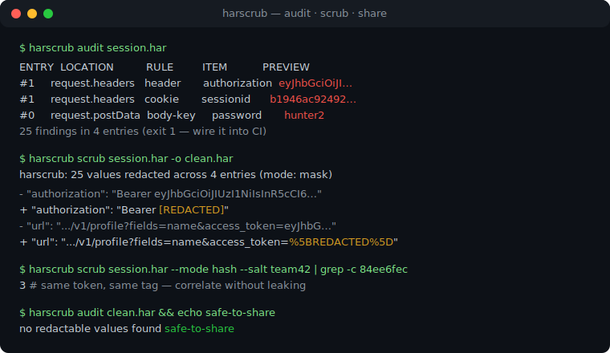
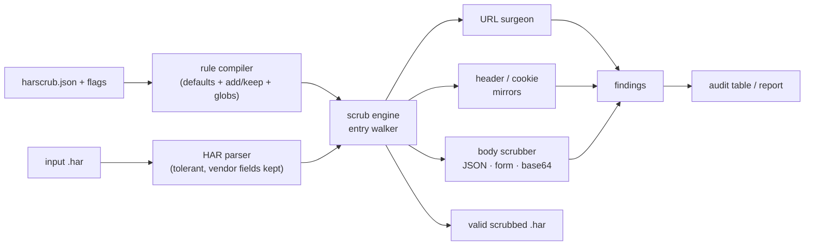

# harscrub

[English](README.md) | [中文](README.zh.md) | [日本語](README.ja.md)

[](LICENSE)   [](CONTRIBUTING.md)

**开源 CLI：在分享 HAR 文件之前抹除认证头、Cookie、令牌与请求响应体——规则可配置、格式保持，抓包在 DevTools 里照常打开。**



```bash
# not yet on npm — install from a checkout of this repository
npm install && npm run build && npm pack
npm install -g ./harscrub-0.1.0.tgz
```

## 为什么选择 harscrub？

"请附上 HAR 文件"是每个网络类 bug 模板的第一句——而 HAR 是你会话的完整记录：`Authorization` 头、会话 Cookie、URL 里的 OAuth code、JSON 响应体里的 refresh token，其中一些还经过 base64 编码，扫一眼根本看不见。每天都有人把这些贴进公开的 issue 系统。现有的出路全都不够：手工编辑一个 5 MB 的 JSON 会漏掉镜像副本（同一个 Cookie 既在原始 `Cookie` 头里*又*在解析后的 `cookies` 数组里——清了一处照样泄漏），网页版清洗工具意味着把你要抹掉的机密先上传一遍且没法进 CI，`jq` 单行命令每次都要从零推导 HAR 语义，而 gitleaks 之类的密钥扫描器只*检测*不*修复*。harscrub 是建立在 HAR 语义之上的清洗器：一套规则同时驱动按名称的抹除（头、Cookie、查询参数、任意 JSON 深度的 body 键）与按形状的令牌探测（JWT、AWS、GitHub、Slack、Stripe、PEM 私钥等），对每个镜像副本一致处理——包括解码后的 base64 响应体——输出仍是合法的、查看器可加载的 HAR，其中所有非机密内容逐字节不变。

| | harscrub | 手工编辑 | 网页版 HAR 清洗器 | 裸 jq | 密钥扫描器 |
|---|---|---|---|---|---|
| 离线运行于终端 / CI | ✅ | ✅ | ❌ 需上传或打开网页 | ✅ | ✅ |
| 理解 HAR 镜像（头 ↔ 数组、url ↔ queryString、text ↔ params） | ✅ | ❌ 很容易漏一处 | 🟡 参差不齐 | ❌ 全靠手写 | ❌ |
| 解码并清洗 base64 响应体 | ✅ | ❌ 根本看不见 | 🟡 很少支持 | ❌ | 🟡 仅检测 |
| 输出仍是合法可加载的 HAR | ✅ | 🟡 一个笔误就坏 | ✅ | 🟡 很容易弄坏 | 不适用 |
| 规则可配置（增删名称、自定义正则） | ✅ | 不适用 | ❌ 固定列表 | ✅ 但要自己写 | 🟡 仅检测 |
| 修复而不只是报告 | ✅ 外加 audit 模式 | ✅ | ✅ | ✅ | ❌ |

<sub>各能力声明依据各方案的公开文档与实际行为核对，2026-07。</sub>

## 特性

- **每个镜像，一致处理** —— HAR 会重复存储数据（`Cookie` 头与 `cookies[]`、URL 与 `queryString[]`、`postData.text` 与 `params[]`）；harscrub 全部改写，机密的任何一份拷贝都不会幸存。
- **名称规则 + 形状探测** —— 默认 23 个凭证头、27 个查询参数、24 个 body 键，外加 14 个令牌模式（JWT、Bearer/Basic、AWS、GitHub、GitLab、Slack、Stripe、Google、SendGrid、npm、PEM 私钥），连藏在*未列名*位置的机密也能抓到。
- **三种抹除模式** —— `mask`（固定的 `[REDACTED]`）、`hash`（确定性的 `[REDACTED:9f8e7d6c]` 标签：同一个会话令牌在所有位置带同一个标签，请求间仍可关联）、`remove`（把载体整个删掉）。
- **格式保持** —— 未触碰的条目逐字节不变，JSON 体保留缩进风格，URL 用字符串手术编辑（绝不重新序列化），base64 体进去 base64 出来，厂商 `_字段` 原样保留，尺寸重新计算而不是留下过期值。
- **规则可配置，且安全** —— `harscrub.json` 只*扩展*默认值（`add`）或显式开洞（`keep`，支持通配符）；未知键是硬错误，`rules` 命令可打印生效的完整规则集。
- **面向 CI 的 audit 模式** —— `harscrub audit` 列出将会泄漏的内容（只显示截断预览）并以 1 退出，pre-commit 钩子或流水线可据此拦截脏抓包；`--json` 供机器消费。
- **零运行时依赖，完全离线** —— 只需要 Node.js；工具从不打开任何 socket，devDependency 仅有 `typescript`。

## 快速上手

清洗自带的示例抓包（一次 OAuth 登录流程，埋满了假机密）：

```bash
# from the root of your checkout
harscrub scrub examples/login.har -o clean.har --report
```

输出（真实运行记录，stderr）：

```text
harscrub: 25 values redacted across 4 entries (mode: mask)
RULE                  COUNT
cookie                8
body-key              7
query-param           4
header                3
pattern:github-token  1
pattern:slack-token   1
url-credentials       1
```

`clean.har` 在 DevTools 里照常加载；其中干净的 CDN 条目逐字节不变。想在分享*之前*看看会泄漏什么——或者给 CI 设闸——用 `audit`（真实运行记录，前几行）：

```bash
harscrub audit examples/login.har   # exit 1: findings exist
```

```text
ENTRY  LOCATION                 RULE                  ITEM           PREVIEW
#0     request.postData.params  body-key              client_secret  s3cr3t-cl13n…
#0     request.postData.params  body-key              password       hunter2
#0     request.postData         body-key              password       hunter2
#0     request.postData         body-key              client_secret  s3cr3t-cl13n…
#0     response.headers         cookie                sessionid      b1946ac92492…
#0     response.cookies         cookie                sessionid      b1946ac92492…
#0     response.content         body-key              access_token   eyJhbGciOiJI…
```

注意 `response.content`：那个 access token 藏在一个 **base64 编码**的 JSON 响应体里。用 `--mode hash` 时镜像保持关联——同一个 JWT 在头、URL 和解析数组里得到同一个标签（真实抓取的值）：

```text
"value": "Bearer [REDACTED:3ac02f51]"
access_token=%5BREDACTED%3A3ac02f51%5D
```

更多场景见 [examples/](examples/README.md)。

## 命令

| 命令 | 作用 | 关键选项 |
|---|---|---|
| `scrub [file\|-]` | 抹除并输出清洗后的 HAR（默认命令） | `-o`、`--in-place`、`--report`、`--drop-content`、`-q` |
| `audit [file\|-]` | 列出将被抹除的内容；有发现则以 1 退出 | `--json` |
| `rules` | 打印生效的规则集（默认值 + 规则文件） | `--json` |
| `init` | 写出一份 `harscrub.json` 起步配置 | `-o` |

`--mode mask|hash|remove` 与 `--salt` 作用于 scrub 和 audit；`--rules <file>` 显式指定规则文件，否则自动发现 `./harscrub.json`（`--no-config` 可忽略）。退出码对脚本友好：`0` 正常，`1` audit 发现可抹除内容，`2` 用法或输入错误。

## 规则文件

| 键 | 默认值 | 效果 |
|---|---|---|
| `mode` / `salt` | `"mask"` / `""` | 抹除模式与 hash 盐值 |
| `headers.add` / `.keep` | `[]` | 扩展或豁免头名称（通配符：`x-internal-*`） |
| `cookies.keep` | `[]` | 要保留的 Cookie 值——其余一律抹除 |
| `queryParams.add` / `.keep` | `[]` | 同上，作用于 URL 查询参数名 |
| `bodyKeys.add` / `.keep` | `[]` | 同上，作用于任意深度的 JSON 键与表单字段 |
| `patterns.disable` / `.custom` | `[]` | 关闭内置探测器，或添加 `{name, regex}` 自定义项 |
| `dropContent` | `false` | 删除所有响应体，留下一条 comment 面包屑 |

合并刻意设计为增量式：规则文件永远不可能悄悄取消对 `authorization` 的保护。完整语义——优先级、模式、各处改写内容、尺寸处理——见 [docs/rules.md](docs/rules.md)。

## 架构



## 路线图

- [x] 覆盖所有 HAR 镜像的规则驱动清洗引擎、三种模式、令牌模式、audit/rules/init 命令、92 个测试 + smoke 脚本（v0.1.0）
- [ ] `--redact-ips` 与主机名假名化，服务基础设施敏感的抓包
- [ ] multipart/form-data 体解析（目前各 part 走模式扫描）
- [ ] 感知 Set-Cookie 的会话追踪报告（"哪些条目共享这个会话？"）
- [ ] 流式模式，处理超出内存的抓包
- [ ] 发布到 npm

完整列表见 [open issues](https://github.com/JaydenCJ/harscrub/issues)。

## 贡献

欢迎贡献。先 `npm install && npm run build` 构建，然后运行 `npm test` 和 `bash scripts/smoke.sh`（必须打印 `SMOKE OK`）——本仓库不带 CI，上述所有声明都靠本地运行验证。参见 [CONTRIBUTING.md](CONTRIBUTING.md)，认领一个 [good first issue](https://github.com/JaydenCJ/harscrub/issues?q=is%3Aissue+is%3Aopen+label%3A%22good+first+issue%22)，或发起一场 [discussion](https://github.com/JaydenCJ/harscrub/discussions)。

## 许可证

[MIT](LICENSE)
